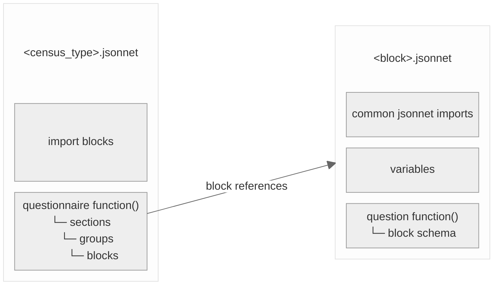

# Schema build process

The schema build process allows us to break down the creation of a schema into manageable chunks. It enables:

- generation of similar schemas with minimal duplication e.g. welsh and english regional variations
- re-use of common JSON, both within a schema and across schemas
- programmatic generation of similar JSON that varies depending on context e.g. proxy/non-proxy
- top level variables e.g. census date allowing us to re-generate the schemas and be sure all occurrences are correct

## What is Jsonnet?

- A tool for programmatically generating JSON
- Adds variables, conditionals, functions and imports
- Has a formatter and linter
- Has editor integrations e.g. VSCode

## Census schemas

The Census schemas that we generate can be broken down as:

| Census type            | Region  | Language |
|------------------------|---------|----------|
| Individual             | England | en       |
|                        | Wales   | en, cy   |
| Household              | England | en       |
|                        | Wales   | en, cy   |
| Communal Establishment | England | en       |
|                        | Wales   |          |  

The `en` language schemas are generated using the `make build-schemas` command. Once these are generated `make translation-templates` will generate the `.pot` files for the Welsh region schemas. Once these templates are translated, `make translate-schemas` will generate the `cy` language schemas.

## The build

### `scripts/build-schemas.sh`

Runs the Jsonnet build command for each census type and region. The script passes three top-level variables:

- region_code
- census_date
- census_month_year_date

### The `source` folder

The following directory structure is used to organise the Jsonnet:
```bash
source/
└── jsonnet/
    └── england-wales/
        ├── census_communal_establishment.jsonnet
        ├── census_household.jsonnet
        ├── census_individual.jsonnet
        ├── communal-establishment/ # used by census_communal_establishment.jsonnet
        │   └── blocks/
        │       ├── detention_establishment.jsonnet
        │       ├── education_establishment.jsonnet
        │       ├── medical_establishment.jsonnet
        │       ├── nature_of_establishment.jsonnet
        │       ├── number_of_people_in_establishment.jsonnet
        │       ├── number_of_visitors_in_establishment.jsonnet
        │       ├── people_in_establishment.jsonnet
        │       ├── responsible_for_establishment.jsonnet
        │       └── travel_establishment.jsonnet
        ├── household/ # used by census_household.jsonnet
        │   ├── blocks/ 
        │   │   ├── accommodation/
        │   │   ├── individual/
        │   │   ├── relationships/
        │   │   ├── visitor/
        │   │   └── who-lives-here/
        │   └── lib/ # common Jsonnet for household schema
        │       └── rules.libsonnet
        ├── individual/ # used by census_individual.jsonnet
        │   ├── blocks/
        │   │   ├── employment/
        │   │   ├── identity-and-health/
        │   │   ├── personal-details/
        │   │   └── qualifications/
        │   └── lib/ # common Jsonnet for individual schema
        │       └── rules.libsonnet
                └── lib/ # common Jsonnet across > 1 census type 
                        ├── common_rules.libsonnet     
                        ├── placeholders.libsonnet
                        └── transforms.libsonnet
```

#### Jsonnet files

There are three broad types of Jsonnet file:

- top-level: one for each census type
  - census_individual.jsonnet
  - census_household.jsonnet
  - census_communal_establishment.jsonnet
- block: one for each block in a questionnaire
- common: shared by blocks / questionnaires

The files are structured consistently:



##### Top-level Jsonnet

Each of the top-level Jsonnet files:

- Imports blocks from the relevant blocks folder
- Has one top-level function that returns the questionnaire schema
- This function is passed the region code and census date top-level variables
- Within the sections -> groups -> blocks of the questionnaire schema definition, the imported blocks are referenced
- The group `id`s align with the folder names within the blocks folders
- Some of the block references are passed top-level variables (region code / census date)

##### Block Jsonnet

Most of the detail is in the block Jsonnet files. Each block Jsonnet:

- imports common Jsonnet (placeholders, rules, transforms)
- declares variables for dynamic schema elements
- always has a `question` function that returns the block schema

##### Common Jsonnet

- Jsonnet that is common across more than one census type is in the top-level `lib` folder
- Jsonnet that is common within a census type is in a `<census_type>/lib` folder


